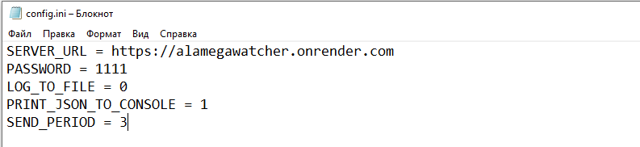

## Описание клиентской части

Клиентское приложение (трекер) представляет собой программу начинающую функционировать при запуске рабочей станции/сервера, подключаясь при помощи протокола WebSocket к серверному приложению, осуществляет сбор и отправку [серверному приложению](https://github.com/Alamega/mitso-diplom-server) значений мониторинга (температура и нагрузка компонентов рабочей станции/сервера согласно датчикам) в режиме реального времени с определенным интервалом. Интервал и настройки подключения указываются в файле config.ini.

### Пример файла конфигурации:

